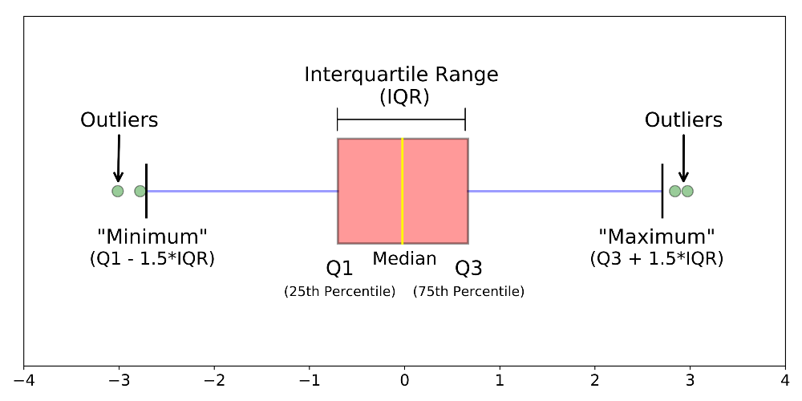

# The-Boxplot-Function
A project for the course Fundamentals of Data Analysis investigating the boxplot function. Submitted by James Quintin to Dr. Ian Mcloughlin.

This project uses the Jupyter Notebook [1] to present live code, visualizations and explanations investigating the boxplot funtion. The code is written in  Python [2] and uses the Anaconda [3] distribution package that contains all necessary software to run this notebook.  

The notebook first explains what a boxplot is then explains the history and use of the boxplot. Examples of boxplots are then presented using python code. References then follows.  

    *Image* of a box plot. https://towardsdatascience.com/understanding-boxplots-5e2df7bcbd51

### References:

[1] https://jupyter.org/

[2] https://www.python.org/ 

[3] https://www.anaconda.com/download/

